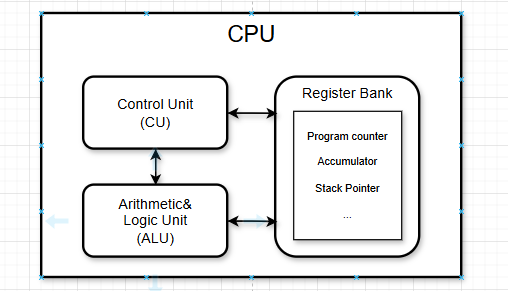
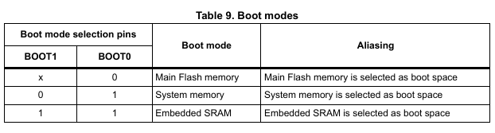
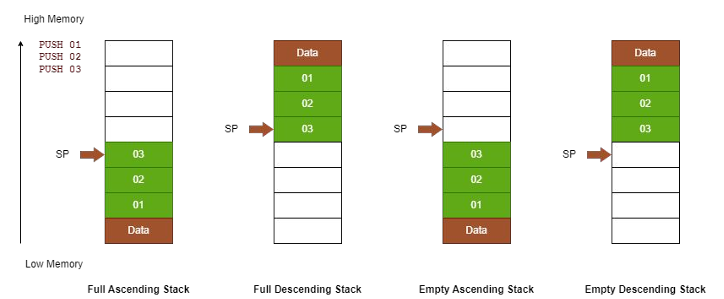
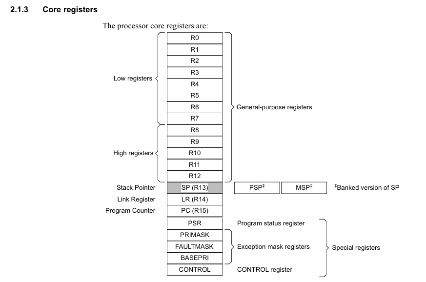

<h1 style="color:rgb(110, 143, 220); text-align: center;">_______________________Cortex-M3_________________________ </h1>

# 📝 __Arm-Cortex-M3 Overview__

## ✨ CPU (Central Processing Unit) :
- __CU__: Điều khiển hoạt động của bộ xử lý. <br>
- __ALU__           : Thực hiện tính toán số học và Logic theo lệnh của CU. <br>
- __Register Bank__ : ALU thực hiện tính toán trên bộ thanh ghi. <br>


<div style="text-align: center;">
  
</div>

## ✨ Memories :
- 128 Kbytes of Flash memory (datasheet ghi 64k nhưng thực tế sử dụng được 128k)
- 20 Kbytes of SRAM
## ✨ Flash :
<div style="text-align: center;">
  
</div>

- Boot từ Flash: Khi BOOT0 = 0, MCU lấy mã từ 0x08000000 và ánh xạ vào 0x00000000.<br>
- Boot từ RAM: Khi BOOT0 = 1, BOOT1 = 1, chương trình chạy từ RAM (0x20000000 ánh xạ vào 0x00000000). <br>
- Boot từ System Memory: Khi BOOT0 = 1, BOOT1 = 0, MCU khởi động từ 0x1FFFF000 (chế độ nạp qua UART). <br>

## ✨ RAM : 
- `Data`: __biến toàn cục, biến static được khởi tạo giá trị__  <br>
Khi chương trình khởi động, dữ liệu từ __Flash__ được copy vào __RAM__. <br>

- `Bss` : __biến toàn cục, biến static không được khởi tạo giá trị__ <br>
Khi chương trình bắt đầu, vùng này được đặt về 0 (zero-initialized). <br>
Không cần copy từ __Flash__. <br>
- `Heap` : __dành cho bộ nhớ cấp phát động (malloc, calloc, new)__<br>
Dữ liệu được lưu cho đến khi được giải phóng (free, delete).<br>
Nếu dùng quá mức có thể gây lỗi Heap Overflow.<br>

- `Stack`:__dành cho biến cục bộ trong hàm và tham số truyền vào hàm__<br>
Mỗi khi một hàm được gọi, bộ nhớ Stack được cấp phát. Khi hàm kết thúc, bộ nhớ được giải phóng tự động.<br>
Nếu dùng quá mức có thể gây lỗi Stack Overflow.<br>
```c
                    +----------------------+    0x20005000  (Đỉnh RAM)
                    |        Stack         |    (giảm dần xuống)
                    +----------------------+
                    |        Heap          |    (malloc() cấp phát động)
                    +----------------------+
                    |        .bss          |    (biến toàn cục chưa khởi tạo)
                    +----------------------+
                    |        .data         |    (biến toàn cục có khởi tạo)
                    +----------------------+
                    |   Chương trình chạy  |
                    +----------------------+    0x20000000 (Bắt đầu RAM)
```
___
# 🚀 Note: <br>
  + `Stack`: được chia làm 4 loại :
<div style="text-align: center;">
  
</div>


==> Arm-Cortex-M3 sử dụng __full descending stack__ .

___
## ✨ __Core register__
### Arm-Cortex-M3, bộ thanh ghi gồm 16 thanh ghi, R0-R15. Ngoài ra còn có các thanh đặc biệt :


<div style="text-align: center;">
  
</div>

## ✨Chi tiết về các thanh ghi :
- `R0-R12`: 13 thanh ghi đa dụng, dùng để tính toán. <br>
  + giá trị trả về sẽ được lưu vào R0 . 
  + nếu truyền tham số vào hàm 
    - R0 = tham số 1 
    - R1 = tham số 2
    - R2 = tham số 3
    - R3 = tham số 4
- `R13(Stack Pointer)` : trỏ đến đỉnh Stack.<br>
  + Có 2 Stack Pointer (cấu hình ở trong thanh ghi __CONTROL__) <br>
    - MSP (Main Stack Pointer) <br> 
    - PSP (Process Stack Pointer) <br>

- `R14(Link Register)` : thanh ghi chứa địa chỉ trả về sau khi một hàm được gọi bằng BL hoặc BLX <br>
  + Khi vào hàm bình thường : 
    - Khi dùng BL, giá trị lưu vào LR là địa chỉ của lệnh kế tiếp +1.
    - Bit 0 của giá trị LR phải là 1 để đảm bảo CPU thực thi ở chế độ __Thumb-2__ <br>
    - Khi quay lại bằng BX LR, CPU đọc địa chỉ từ LR, nếu bit 0 = 0, CPU sẽ lỗi __HardFault__
  + Khi vào hàm ngắt :
    - Giá trị LR sẽ được lưu vào stack và LR sẽ nhận một giá trị đặc biệt __EXC_RETURN__
```c
            |Giá trị LR(EXC_RETURN) |	          Ý nghĩa
            |      0xFFFFFFF1	    | Trở về Handler Mode, sử dụng MSP
            |      0xFFFFFFF9	    | Trở về Thread Mode, sử dụng MSP
            |      0xFFFFFFFD	    | Trở về Thread Mode, sử dụng PSP (context switching)
```

- `R15(Program counter)` : chứa địa chỉ lệnh đang được thực thi. <br>
  + Khi quay lại bằng BX LR, CPU đọc địa chỉ từ LR, nếu bit 0 = 0, CPU sẽ lỗi __HardFault__ <br>
  + Trên các dòng hỗ trợ ARM full, nhưng Cortex-M3 chỉ chạy __Thumb-2__

## 🚀 Note: <br>
  - `Thumb-2 state`: 
    + Do bit 24 của thanh ghi EPSR = 1 (__Thumb state bit__) <br>
    ==> Arm-Cortex-M3 chỉ chạy Thumb-2, không hỗ trợ chế độ ARM 32-bit .
    + Thumb-2 kết hợp lệnh 16-bit và 32-bit giúp __tối ưu hiệu suất__ và __tiết kiệm bộ nhớ__ <br>
___
- `PSR(Program Status register)`: lưu trữ thông tin trạng thái của CPU, giúp quản lý cờ trạng thái, trạng thái ngắt, và mã exception đang xảy ra .
  + Application PSR (APSR) – Chứa cờ trạng thái (N, Z, C, V, Q).`APSR: Bit [31:27]`<br>
  + Interrupt PSR (IPSR) – Xác định số ID của exception/ngắt hiện tại. `IPSR: Bit [8:0]`<br>
  + Execution PSR (EPSR) – Điều khiển chế độ thực thi (chỉ Thumb mode).EPSR: Bit [24]<br>

- `PRIMASK` : vô hiệu hóa toàn bộ các ngắt thông thường (IRQ), ngoại trừ __HardFault__ và __NMI__ <br>
```c
  //Bật PRIMASK =1  
    __ASM ("cpsid i");   
 
  //Xóa PRIMASK = 0 
    __ASM ("cpsie i");
```

- `FAULTMASK`: Vô hiệu hóa tất cả các ngắt kể cả __HardFault__, ngoại trừ __NMI__ <br>
```c
  //Bật FAULTMASK =1 (core_cm3.h)   
    __disable_irq();
      //hoặc 
    __ASM ("cpsid f");   

  //Xóa FAULTMASK = 0 (core_cm3.h)   
    __enable_irq(); 
      //hoặc 
    __ASM ("cpsie f");
```
- `BASEPRI`: ngăn chặn việc kích hoạt tất cả các ngoại lệ có `mức ưu tiên` <= `BASEPRI` <br>
```c
  __set_BASEPRI(0x40);  // Chặn tất cả các ngắt có giá trị ưu tiên lớn hơn 0x40 
    //hoặc 
  __ASM("MOV R0, #0x40 \n" " MSR BASEPRI, R0 \n");
    //hoặc 
  __ASM("MSR BASEPRI, %0" :: "r"(0x40));
```
- `CONTROL`: quản lý stack pointer, mức đặc quyền __privilege level__, và chế độ thực thi __Thread/Handler Mode___ <br>
```sh
| Bit	|   Tên	    |                     Ý nghĩa
|  0	|   nPRIV   |  0 = Chế độ Privileged (Đặc quyền, có quyền truy cập đầy đủ) 
|       |           |  1 = Chế độ Unprivileged (Không đặc quyền, bị hạn chế quyền truy cập) 
|  1	|   SPSEL	|  0 = Sử dụng MSP (Main Stack Pointer) 
|       |           |  1 = Sử dụng PSP (Process Stack Pointer)
```
```c
  // Bật bit nPRIV -> Unprivileged Mode
  __set_CONTROL(__get_CONTROL() | 0x1);
  // Xóa bit nPRIV -> Privileged Mode
  // Có thể thay đổi nhưng phải gọi trong 1 hàm ngắt nào đó 
  void SVC_Handler(void) {
    __set_CONTROL(__get_CONTROL() & ~0x1);
  } 
  void switch_to_privileged(void) {
    __ASM("SVC #0");  // Gọi ngắt SVC để vào Privileged Mode
  }
```
```c
// Bật bit SPSEL -> Dùng PSP
  __set_CONTROL(__get_CONTROL() | 0x2);  
// Xóa bit SPSEL -> Dùng MSP
  __set_CONTROL(__get_CONTROL() & ~0x2);  
```
## ✨ Interrupt <br>

- ARM Cortex-M3 hỗ trợ 2 loại ngắt chính : <br>
    + `Exception`: Các sự kiện đặc biệt do phần cứng hoặc hệ thống tạo ra (Reset, HardFault, SysTick,...)
    + `IRQ`: Các ngắt từ thiết bị bên ngoài.
    + `Exception`có mức ưu tiên __cố định__, còn các `IRQ`có thể được lập trình để `thay đổi` mức ưu tiên.
    + `NMI` và `HardFault` có mức ưu tiên cao nhất và không thể bị vô hiệu hóa.
- Quá trình xử lý vào ngắt :
    + `b1`: CPU hoàn thành lệnh hiện tại và kiểm tra ngắt
    + `b2`: CPU chọn ngắt có mức ưu tiên cao nhất và đẩy __xPSR, PC, LR, R12, R3, R2, R1, R0__ vào __stack__
    + `b3`: CPU đọc bảng vector trên __bus ICode__ trong khi push dữ liệu trên __bus DCode__
    + `b4`: Nếu ngắt là Reset, CPU nạp giá trị SP từ bảng vector.
    + `b5`: CPU lấy địa chỉ ISR từ bảng vector và nạp vào __PC__
    + `b6`: CPU cập nhật giá trị __LR = EXC_RETURN__ 
    + `b7`: CPU thực thi ISR
- Quá trình xử lý thoát khỏi ngắt :
    + Nếu có một ngắt pending có độ ưu tiên cao hơn → thực hiện __Tail-Chaining__ (chuyển ngay vào ngắt mới, <br>
    không cần pop/push lại stack)
    + Nếu một ISR trước đó vẫn đang xử lý → quay lại ISR đó.
    + Nếu không còn ISR nào đang chờ → quay về Thread Mode, khôi phục PC và tiếp tục chương trình chính. <br>


##  🔧 ⭐️ ❤️ ✨🚀
---


<!--  -->