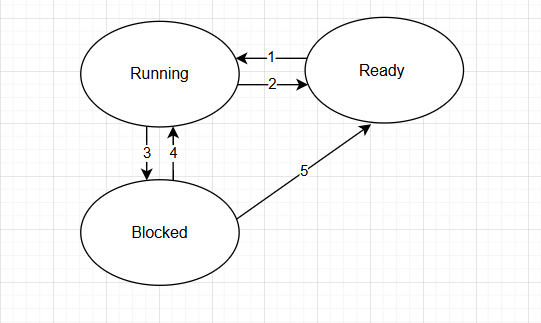

<h1 style="color:rgb(110, 143, 220); text-align: center;">__________________Real-Time Operating System_____________________ </h1>


# Thread
- `Thread` : quá trình thực thi của 1 Task.
-  Một thread gồm:
    + 1 bộ thanh ghi.
    + Bộ nhớ Stack.
    + Chương trình để thực thi
- STM32 chỉ có 1 core với 1 Register Bank duy nhất. <br>
 ==> Phải liên tục chuyển đổi việc sử dụng thanh ghi giữa các Task.

___
# Thread Scheduler
## Tổng quan Scheduler

-  Thread thường có 3 trạng thái chuyển đổi lẫn nhau
    + Running: Thread đang được thực thi bởi CPU.
    + Ready: Thread sẵn sằng được thực thi bởi CPU.
    + Blocked: Thread đang đợi 1 sự kiện nào đó để được kích hoạt.<br>

<div style="text-align: center;">
    
</div>

- Tại 1 thời điểm chỉ có 1 __Thread__ ở trạng thái __Running__, các __Thread__ còn lại sẽ chờ ở __Ready__ và __Blocked__
    + `(1) Ready→Running` :khi __Thread__ đang __Running__ hoàn tất hoặc __Thread Ready__ có độ ưu tiên cao hơn.
    + `(2) Running→Ready` : khi __Thread Ready__ có ưu tiên cao hơn, hoặc __Thread Running__ hết thời gian thực thi.
    + `(3) Running→Blocked` : khi đang thực thi đến điểm cần 1 sự kiện nào đó xảy ra.
    + `(4) Blocked→Running` : khi sự kiện kích hoạt xảy ra, và __Thread__ có độ ưu tiên cao hơn cả __Ready__ và __Running__.
    + `(5) Blocked→Ready` : khi sự kiện kích hoạt xảy ra nhưng độ ưu tiên thấp hơn hoặc ngang với __Ready__ hay __Running__.<br>

## Scheduler Criteria
 - Scheduler được đánh giá dựa trên các tiêu chí:
    + `Throughput` : Số lượng task thực hiện được trong 1 đơn vị thời gian.
    + `Turnaround time`: Thời gian để hoàn thành mỗi task (xuất hiện -> hoàn thành).
    + `Response time`: Thời gian từ khi yêu cầu đến khi nhận được phản hồi đầu tiên.
    + `Wait Time`: Thời gian mỗi task phải chờ trong trạng thái __Ready__.
    + `CPU Utilization`: % chu kỳ CPU khả dụng đang được dùng.
 - Scheduler tốt sẽ cần:
    + Tối đa hóa __Throughput__.
    + Giảm __Turnaround time__ và __Response time__.
    + Tối ưu hóa __CPU Utilization__.
## Các thuật toán Scheduler
### First Come First Serve (FCFS)
- Non Preemptive.
- Task nào đến trước sẽ được thực thi trước, lần lượt theo kiểu FIFO queue.
- Ví dụ : <br>
<div style="margin-left: 100px;">

- Yêu cầu bài toán

|Thread   |      |   A   |   |B   ||   C  | |   D   |
|:-------|:------:|:------:|:------:|:------:|:------:|:------:|:------:|:------:|
|Execution Time ||   5   ||   3   ||   8   ||   6   |
|Arrival Time   ||   0  | |   1   ||   2   ||   3   |

___
+ Thời gian thực hiện 

|Start|A|➡️|B|➡️|C|➡️|D|End|
|:-:|:-|:-:|:-:|:-:|:-:|:-:|:-:|:-:|
|0 ||5 | |8| | 16|| 22|

___

+ Tính toán các thông số

| Thread |Arrival time<br>(At) |  Execution time<br>(t) |Service time<br>(St)  |Wait time<br>(Wt = St - At) |Turnaround time<br>(t + Wt)|
|:---:|:---:|:---:|:---:|:----:|:----:|
|   A    | 0 |5| 0| 0| 5
|   B    | 1 |3| 5| 4| 7
|   C    | 2 |8| 8| 6| 14
|   D    | 3 |6| 16| 13| 19

+ __Trung bình Wait time: (0+4+16+13)/4 = 5.75 ms / Thread;__ 
+ __Trung bình Throughput: 4/22 = 0.18 Threads/ms.__
</div>

### Round Robin(RR)

- Preemptive.
- Sử dụng việc chia sẻ thời gian. Mỗi thread sẽ có 1 thời gian thực hiện nhất định- timeslice (quanta).
- Khi 1 thread thực hiện hết 1 khoảng timeslice, Scheduler sẽ chuyển CPU cho thread khác
- Ví dụ :

<div style="margin-left: 100px;">

- Yêu cầu bài toán

|Thread   |      |   A   |   |B   ||   C  | |   D   |
|:-------|:------:|:------:|:------:|:------:|:------:|:------:|:------:|:------:|
|Execution Time ||   5   ||   3   ||   8   ||   6   |
|Arrival Time   ||   0  | |   1   ||   2   ||   3   |


___
+ Thời gian thực hiện (chọn Timer quanta = 3(ms))

|Start|A|➡️|B|➡️|C|➡️|D|➡️|A|➡️|C|➡️|D|➡️|C|End|
|:-:|:-|:-:|:-:|:-:|:-:|:-:|:-:|:-:|:-:|:-:|:-:|:-:|:-:|:-:|:-:|:-:|
|0 ||3 | |6| | 9|| 12||14||17||20||22
___

+ Tính toán các thông số

| Thread |Arrival time<br>(At) |  Execution time<br>(t) |Service time<br>(St)  |Wait time<br>(Wt = St - At) |Turnaround time<br>(t + Wt)|
|:---:|:---:|:---:|:---:|:----:|:----:|
|   A    | 0 |5| 0.12| (0-0)+(12-3)=9| 14
|   B    | 1 |3| 3| 3-1 = 2| 5
|   C    | 2 |8| 6,14,20|  (6-2)+(14-9)<br>+(20-17)=12| 20
|   D    | 3 |6| 9,17|  (9-3)+(17-12) = 11| 17

+ __Trung bình Wait time: (9+2+12+11)/4 = 8.5 ms /Thread;__
+ __Trung bình Throughput: 4/22 = 0.18 Threads/ms.__
</div>

### Lưu ý khi chọn Time Quanta
- Quanta quá lớn so với thời gian thực thi của Thread, RR=FCFS.
- Quanta quá nhỏ, RR hoạt động như processor. Tuy nhiên phải thực hiện context switching liên tục <br>
==>Tốn nhiều tài nguyên xử lý. <br>
- Time quanta không được chọn quá lớn hoặc quá nhỏ so với thời gian thực thi thread trung bình. 
Nên chọn time quanta vừa phải và lớn hơn so với thời gian context switching


# Các thành phần quan trọng cần có:
+ Task (nhiệm vụ)
    - Một chương trình nhỏ chạy độc lập, có stack riêng.
    - Chứa vòng lặp vô tận để thực thi công việc cụ thể.
    - Các task có thể có độ ưu tiên khác nhau.
+ Scheduler (Bộ lập lịch)   
    - Quyết định task nào được chạy tiếp theo.
    - Lập lịch có thể là __Round Robin(RR)__ hoặc __First Come First Serve(FCFS)__.
+ PendSV Handler (Bộ xử lý ngắt PendSV)
    - Được dùng để chuyển đổi giữa các task.
    - Lưu trạng thái của task hiện tại và khôi phục trạng thái của task tiếp theo.
+ Switch to PSP (Chuyển sang chế độ Process Stack Pointer - PSP)
    - Trong ARM Cortex-M3, có hai chế độ stack:
    - MSP (Main Stack Pointer): Dùng cho xử lý ngắt.
    - PSP (Process Stack Pointer): Dùng cho task người dùng.
    - Khi chạy task, cần chuyển từ MSP sang PSP.
+ SysTick Timer (Bộ định thời hệ thống)
    - Định kỳ gọi ngắt để trigger scheduler.
    - Mỗi lần ngắt xảy ra, scheduler sẽ kiểm tra và chuyển đổi task nếu cần.
# Các bước khi tự build RTOS mini kernel 
- Gán giá trị cho MSP lên vùng RAM riêng <br>
    + Mục đích:  mỗi lần vào ngắt chạy các hàm ngắt như systick, PenSv,... sẽ không bị ảnh hưởng tới vùng ram của các task khác (MSP sử dụng cho ngắt || PSP sử dụng cho thread)
- Khởi tạo cho các task . Giả lập stack frame<br>
    + gán trạng thái cho các task 
    + gán giá trị cho PSP vào các vùng của task tương ứng 
    + gán địa chỉ của các hàm vào con trỏ hàm tương ứng 
    + điền stask frame tương ứng :
        - psp sẽ = đỉnh của task 
        - xPSR = 0x01000000(bật Thumb bit)
        - PC = địa chỉ hàm của để thực hiện cho task đó 
        - LR = EXC_RETURN (0xFFFFFFFD : chạy thread mode)
        - Gán giá trị = 0 cho các thanh ghi R0-R12 
        - Sau khi điền đủ 17 giá trị (stack frame 17 x 4 = 68 byte) thì phải gắn giá trị psp chính bằng điểm cuối của frame vừa gán . để sau khi vào hàm psp sẽ nạp giá trị này vào và POP giá trị của 17 thanh ghi kia ra . 
- Tại sao lại phải tạo stack frame giả :
    + ARM Cortex-M sử dụng hardware stack mechanism khi xử lý ngắt hoặc nhảy vào task:
    + Khi một task được chuyển sang thực thi (bởi scheduler), CPU sẽ load các thanh ghi từ PSP như thể nó vừa trở về từ một ngắt (EXC_RETURN).
    + Vì thế, để task có thể bắt đầu chạy, bạn phải chuẩn bị sẵn stack giống như CPU vừa bị ngắt và chuẩn bị resume lại.
- chuyển dữ từ MSP qua PSP :
    + push LR vào trong stack để tí nữa chuyển qua psp xong thì sẽ POP LR để quay lại vị trí bản đầu 
    + lấy giá trị PSP của task hiện tại . kết quả trả về sẽ được lưu trong R0
    + lấy giá trị R0 gán vào cho PSP 
    + Khôi phục lại LR trước đó 
    + chọn PSP làm SP bằng bit 1 ở thanh ghi CONTROL 
    + quay lại bằng lệnh BX LR 
```C
__attribute__((naked)) void switch_msp_to_psp(void) {
    __asm__ volatile ("PUSH {LR}"); // lưu giá trị LR lên MSP 
    __asm__ volatile ("BL get_psp_value"); // lấy giá trị của PSP hiện tại 
    __asm__ volatile ("MSR PSP, R0");
    __asm__ volatile ("POP {LR}");
    __asm__ volatile ("MOV R0, #0x02");
    __asm__ volatile ("MSR CONTROL, R0");
    __asm__ volatile ("BX LR");
}
```
- PenSv :
```c
__attribute__((naked)) void PendSV_Handler(void) {
    // 1. Lưu các thanh ghi R4-R11 vào stack của task hiện tại (dùng PSP)
    __asm__ volatile ("MRS R0, PSP");              // R0 = PSP hiện tại
    __asm__ volatile ("STMDB R0!, {R4-R11}");       // push R4-R11 lên stack

    // 2. Gọi hàm để lưu giá trị PSP lại vào mảng task
    // R0 là tham số thứ nhất khi gọi vào hàm 
    // R1 là tham số thứ 2 khi gọi vào hàm
    // mà RO đã được gán giá trị của PSP vào ở bước 1 rồi nên giá trị của tham số truyền vào save_psp_value = PSP  
    __asm__ volatile ("PUSH {LR}");
    __asm__ volatile ("BL save_psp_value");        // lưu PSP vào user_tasks[i].psp_value
    // 3. Cập nhật task tiếp theo sẽ chạy
    __asm__ volatile ("BL update_next_task");

    // 4. Lấy lại PSP của task tiếp theo
    __asm__ volatile ("BL get_psp_value");         // trả về PSP mới trong R0

    // 5. Khôi phục R4–R11 của task mới từ stack
    __asm__ volatile ("LDMIA R0!, {R4-R11}");
    __asm__ volatile ("MSR PSP, R0");              // Gán PSP mới

    // 6. Quay lại tiếp tục task mới
    __asm__ volatile ("POP {LR}");
    __asm__ volatile ("BX LR");
}

```
- Delay trong OS .
    + Khi vào hàm delay thì tắt hết ngắt thông tường của task đó .
    + Gán block count của task đó bằng với systick + thời gian delay mong muốn 
    + gán state cho stask đó bằng block 
- Trong systick handler thì liên tục kiểm tra xem task hiện tại đã hết thời gian hay chưa 
    + nếu hết thời gian delay : chuyển state thành RUNNING 
    + nếu chưa hết thời gian thì break 

# Pro tip 
- Cách dùng sentinel value để kiểm tra tràn stack
- Ý tưởng:
    + Khi bạn cấp phát stack (PSP hoặc MSP), trước khi sử dụng, hãy fill stack đó với giá trị đặc biệt, ví dụ: 0xA5A5A5A5.
    + Khi task chạy, stack sẽ ghi đè từ trên xuống dưới. Sau này, bạn chỉ việc quét lại vùng stack đó xem còn bao nhiêu byte chưa bị ghi đè ➜ biết được mức sử dụng cao nhất của stack (high water mark).

```c
#define STACK_SENTINEL  0xA5A5A5A5

void init_task_stack(void) {
	for (int i = 0; i < MAX_TASKS; i++) {
		// Fill toàn bộ vùng stack với giá trị sentinel
		uint32_t *stack_mem = (uint32_t *)(task_stack_start[i] - STACK_SIZE);
		for (int j = 0; j < STACK_SIZE / 4; j++) {
			stack_mem[j] = STACK_SENTINEL;
		}

		// Setup PSP như bạn đã làm trước đó
		uint32_t *pPSP = (uint32_t *)task_stack_start[i];
		// ... tiếp tục init như đã có: xPSR, PC, LR, R0-R12
	}
}

```
---
© 2025 [Trần Hoàng]. Bảo lưu mọi quyền.