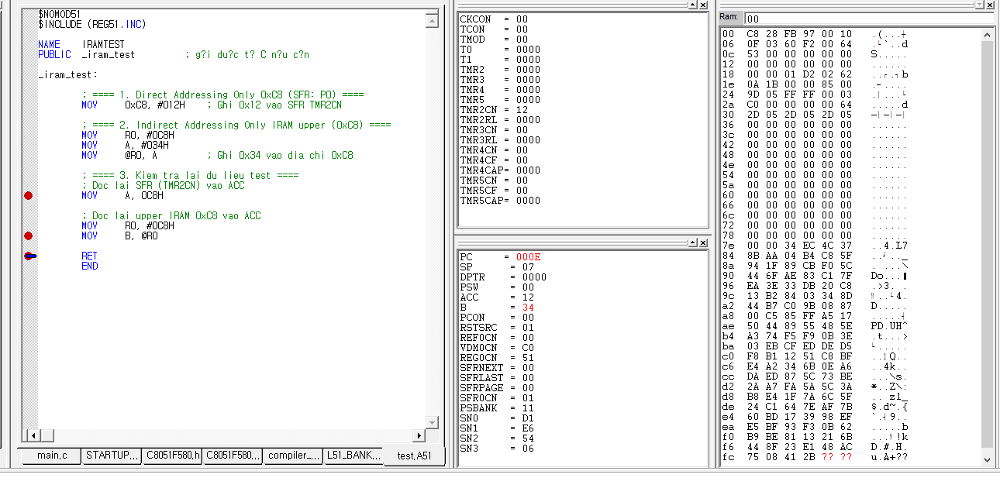

<h1 style="color:rgb(110, 143, 220); text-align: center;">_____________________8051 CPU_______________________ </h1>

# __8051 CPU Overview__
<div style="text-align: center;">
  
</div>

## Memories :
- 128 kBytes of Flash memory
- 256 bytes iRAM and 8kBytes xRAM

## iRAM 
<div style="text-align: center;">
  
</div>

- Có 256 bytes iRam(0x00-0xff)
- Vùng thấp (Lower 128 RAM)
  + 0x00-0x1f : General Purpose Registers. <br>
    + 0x00-0x07 : R0-R7 Bank 0
    + 0x08-0x0f : R0-R7 Bank 1
    + 0x10-0x17 : R0-R7 Bank 2
    + 0x18-0x1f : R0-R7 Bank 3
  + 0x20-0x2f : Có thể truy cập bit, những thanh ghi nào có địa chỉ chia hết cho 8 thì có thể truy cập theo bit 
  + 0x30-0x7f : vùng đa dụng lưu `data` , `bss` và `stack`
- Vùng cao (Upper 128 RAM)
  + Direct : truy cập SFR
  + Indirect : truy cập vùng Upper iRam thật sự 
  + Ví dụ :

```AS
        ; ==== 1. Direct Addressing Only 0xC8 (SFR: P0) ====
        MOV     0xC8, #012H    ; Ghi 0x12 vao SFR TMR2CN

        ; ==== 2. Indirect Addressing Only IRAM upper (0xC8) ====
        MOV     R0, #0C8H
        MOV     A, #034H
        MOV     @R0, A         ; Ghi 0x34 vao dia chi 0xC8

        ; ==== 3. Kiem tra lai du lieu test ====
        ; Doc lai SFR (TMR2CN) vao ACC
        MOV     A, 0C8H

        ; Doc lai upper IRAM 0xC8 vao ACC
        MOV     R0, #0C8H
        MOV     B, @R0

```
  <div style="text-align: center;">
  
</div>


## Stack

- Như đã biết Stack được chia làm 4 loại : [stack][def] <br>
-> Stack của CIP51 là theo dạng __full ascending stack__
- Giải thích chi tiết :
  + Bộ nhớ stack không bị giới hạn trong vùng cố định iRAM nhưng để tránh ghi đè thêm thanh ghi hoặc SFR thì sẽ nằm ở 0x30- 0x7f 
  + Giá trị của Stack sẽ chỉ vị trí cuối cùng đã sử dụng 
  + Giá trị mặc định của Stack = 0x07 , vì từ 0x08-0x1f là các thanh ghi của bank khác nên nếu sử dụng các bank khác thì dễ gây ra lỗi 
  + Giá trị push vào đầu tiên là 0x80 (R0 - Bank 1)

## Chi tiết về các thanh ghi :
  - R0-R7 : các tham số truyền vào hàm khi hàm được gọi lần lượt sẽ được lưu vào R7 - R0
  - ACC : thanh ghi tính toán (chứa giá trị trả về của 1 hàm) 
  - PSW : thanh ghi trạng thái của hệ thống , điều chỉnh chọn R0-R7 của Bank tùy ý .
  - SP : con trỏ luôn trỏ tới đỉnh của stack 
  - PC : chứa địa chỉ của lệnh đang thực thi . 
## Quá trình xảy ra ngắt 
  - Ngắt xảy ra khi bit EA được bật 
---
© 2025 [Trần Hoàng]. Bảo lưu mọi quyền.

[def]: ../../Stm32f10x/1.Basic_knowledge/Cotex_M3.md#*note 